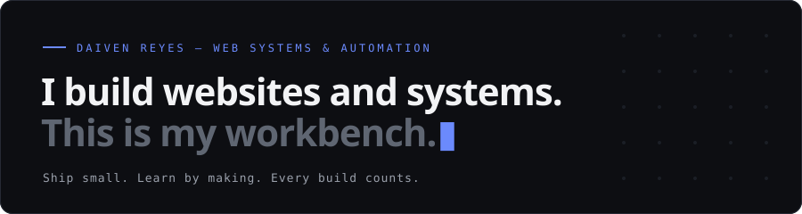
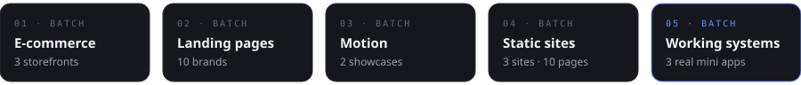

  

### Now

- Building **keel** — a zero-dependency CSS framework that starts with your design system: one stylesheet, five native cascade layers, zero JavaScript, WCAG AA enforced in code. [rdaiven.github.io/keel](https://rdaiven.github.io/keel)
- Building **inwright** — a zero-dependency static site generator and flat-file CMS. It started as a design prototype in my portfolio and became a real tool. Private while it grows; public release coming.

### The Prototype Lab

**[rdaiven.github.io](https://rdaiven.github.io)** — 21 prototypes designed and coded from scratch, each with its own design system. All of them are live, clickable demos.

  

### Stack

`WordPress` `Elementor` `ACF/SCF` `WooCommerce` · `React` `Tailwind` `PostgreSQL` `REST APIs` · `Technical SEO` `GSC` `GA4` · `Claude Code` `Anthropic API` `MCP` `n8n`

### Elsewhere

[Portfolio](https://rdaiven.github.io) · [Resume](https://rdaiven.github.io/resume.html) · [LinkedIn](https://www.linkedin.com/in/daivenr)
